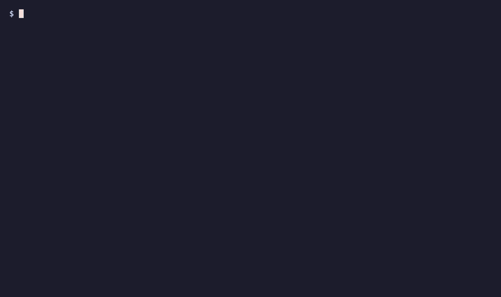

# Delta Learning

**"The corpus didn't change. I changed."**

Built for *Hack the Video Agent Context Graph* (TwelveLabs · OpenAI · Neo4j · AWS) on
30 July 2026, where it won its track, on top of the
[`video-context-graph`](https://github.com/jpadams/video-context-graph) starter.

> **Status: finished artifact, not an active project.** It works, it's documented, and
> `make demo` runs with no API keys — but nobody is developing it. Issues and PRs may sit.
> The two findings in [What we learned](#what-we-learned) are the part most worth your
> time; they cost a weekend to discover.



*Real UI, real graph, no API keys for the cut list itself. The talk starts at* watch 16:08
*of 17:47. Answering two questions correctly takes it to* 11:00 *— and the third answer, a
hand-wave, is refused, so that concept stays in the cut list. Recording script:*
[`frontend/e2e/record-cut-list.mjs`](frontend/e2e/record-cut-list.mjs).

---

## The wedge

Every video-understanding tool answers **"what's in this video?"** — search, summarize,
timestamp, chapterize. That question is retrieval, and retrieval is a solved product.

It is also the wrong question for a person with 45 minutes of talk and 10 minutes to spend.
The question that matters is **"what's in this video that I don't already know?"** — and no
retrieval system can answer it, because the answer isn't a property of the video. It's the
difference between the video and *the viewer*.

So we put the viewer in the graph. The viewer's knowledge state — concepts from their
Obsidian vault plus their stated learning goals — lives as `(:Concept)` nodes in the **same
Neo4j graph** as the video segments, linked to video terms by resolved `SAME_AS` / `ADVANCES`
edges. Once both sides are nodes in one graph, "what should I watch?" stops being a ranking
problem and becomes a **set difference you can traverse**, returning a timecoded cut list.

And it compounds: capture what a video taught you, and the knowledge state grows, and the
*next* video's cut list shrinks. Same corpus, less to watch.

---

## See it

Building a graph needs OpenAI and TwelveLabs. *Reading* one doesn't — the delta traversal
is pure Cypher. So the repo ships a snapshot of a real graph, and you get a real cut list
without an account anywhere.

**Prerequisites:** Docker · [uv](https://docs.astral.sh/uv/) (Python 3.10–3.13) · Node 18+.

```bash
make install     # uv sync + npm install
make demo        # Neo4j + load the shipped graph + start the app
```

Open **http://localhost:3000**, pick a talk, open **Your Cut**: timecoded ranges, orange
badges for concepts new to you and blue for ones serving a stated goal, and each skipped
concept traced to the note that already covers it.

Then run the loop the project exists for — capture a different talk and watch this one
shrink:

```bash
curl -X POST localhost:8000/api/capture -H 'content-type: application/json' \
  -d '{"video": "How Decision Making"}'
```

Reload Your Cut on *A Simple Strategy*. Same corpus, same graph, less to watch.

The snapshot is the author's own graph — four talks and a knowledge state from one
person's notes, carrying segment summaries, topics, entities and resolved concept edges,
but no embeddings, transcripts or captured concepts. Chat needs an `OPENAI_API_KEY`;
nothing above does.

To put it back:

```cypher
MATCH (c:Concept) WHERE c.key STARTS WITH 'video:' DETACH DELETE c
```

---

## The measured beat

Measured on the author's graph — four talks, one person's Obsidian vault — on 2026-07-30.
That exact graph ships as `data/demo_graph.json`, so every number below is reproducible
with `make demo` and no API keys. Your own corpus will read differently; see
*Honest limitations* for why a fresh vault starts out overlapping very little.

Two game-theory talks, ingested independently, no shared metadata — just shared concepts
that MERGE'd into the same graph nodes.

```
Game Theory B ("A Simple Strategy…", 17:46)   BEFORE   watch 16:08 · 2 cuts · 0 known concepts

  → watch Game Theory A ("How Decision Making…", 9:50)
    POST /api/capture {"video": "How Decision Making"}      captures 11 concepts

Game Theory B                                  AFTER   watch  9:32 ·          3 known concepts
```

**41% less to watch. 6:36 saved on one talk, from having watched a different one.**

And the agent says *why*, out loud, citing the source:
> *"Skip 0:00–5:08 … you learned that from* How Decision Making is Actually Science.*"*

The six concepts it now skips — Game Theory, Prisoner's Dilemma, Dominant Strategy — are
`(:Concept {source:'video'})` nodes created by the capture, reached through the `SAME_AS`
edges on terms that both talks share.

The other measured reads — the L8 talk, Postgres, goal coverage, and what GDS PageRank
says to learn first — are in [`docs/measured.md`](docs/measured.md).

---

## What we learned

Two findings survived the weekend. Both are negative results in the sense that matters —
they killed an approach that sounded obviously right — and both are the reason the rest of
the code looks the way it does.

**1. There is no cosine threshold that resolves claim-shaped text to noun-phrase terms.**

Vault concepts are claims (*"test the workflow before reaching for an agent"*). Video terms
are bare noun phrases (*"Agent Orchestration"*). They mean the same thing and the embedding
space does not care: **median best-match cosine on this corpus is 0.43 — for pairs a human
confirms are true matches.** Any threshold that accepts them also accepts noise, and every
threshold that rejects noise also rejects true matches. We measured this before designing
around it.

So the two models split the job by what each is actually good at. **Marengo ranks and never
rejects** — top-8 nearest concepts per term. **OpenAI adjudicates** with structured outputs,
in two passes asking different questions: *identity* (`SAME_AS`) and *topical relevance*
(`ADVANCES`). Nothing merges, so every verdict stays inspectable as an edge in the graph.
If you are matching informal human text against extracted terms, this is the part to steal.

**2. PageRank is a leverage signal, not a foundation signal — so it cannot order a
curriculum.**

The obvious idea: run PageRank over the concept co-occurrence graph and teach the
highest-ranked things first. It fails on its own test. It scores **Shapley Value 2.119 above
Game Theory 1.816** — it would teach the specialisation before the field, because PageRank
measures how *densely discussed* a term is, not how *foundational* it is.

What works instead is embarrassingly simple: **first-teaching time within a video.** A
speaker builds up in order, so the order they introduce terms is a prerequisite graph you
get for free. 10/10 on our test set, against 7/11 for PageRank.

PageRank is still in the codebase — it's exactly right for `learning_frontier` ("what
unlocks the most other unknown material"), which is a leverage question. It is just the
wrong tool for "where do I start."

---

## Honest limitations

- **The vault is evidence of what was written down, not of what is known.** Someone can
  understand Nash equilibria perfectly and have never made a note about them. This is the
  system's biggest weakness. `quiz_me` and the onboarding pass both attack it, but
  neither is a complete answer: what someone can demonstrate in two sentences is its own
  kind of proxy, and nothing here decays, so a concept proven once stays known forever.
- **Onboarding inherits the term classifier's misses.** It spends questions on the
  highest-leverage *unknown* terms, and if `classify_terms.py` failed to mark something as
  transcript noise, that noise is a candidate. On the shipped corpus, 2 of the first 5
  questions land on junk terms from one talk (`No Mistakes`, `FirstMate`). `x.learnable`
  is a node property, so overriding one is a single Cypher write — but a scarce question
  spent on noise costs more than a noisy badge in a cut list does.
- **Before any capture, every video in this corpus reads 91–100% watch.** That is honest,
  not a bug: this vault genuinely contains no game theory and no Postgres, and little on
  agentic engineering. Widening the vault scan from one folder to four moved it 33 → 109
  concepts and that is the ceiling. The contrast in the demo is produced by the **capture
  loop**, not by vault overlap, and the agent says so rather than pretending otherwise.
- **Pegasus segmentation is approximate.** Boundaries and timestamps drift, and analyze is
  capped at 4096 output tokens, so a 45-minute talk gets coarser segments than a 9-minute
  one (~34 segments max). Cut ranges are clamped to the real runtime because Pegasus
  timestamps can overrun it.
- **Resolution is LLM-adjudicated, so it has a taste.** No cosine floor rejects candidates
  (that measurably rejected true matches), which puts the whole precision burden on the
  adjudicator. Verdicts are stored as edges precisely so they can be audited.
- **`/api/watchlist` ranks only ingested videos** — it cannot recommend something not
  already in the graph.

---

## Going deeper

- [`docs/how-it-works.md`](docs/how-it-works.md) — the full pipeline: ingestion, the
  knowledge state, the two-stage resolver, the delta traversal, capture, quiz, onboarding,
  and where each sponsor is load-bearing.
- [`docs/self-host.md`](docs/self-host.md) — running it on your own videos and notes. Needs
  OpenAI and TwelveLabs keys and real spend.
- [`docs/api.md`](docs/api.md) — every endpoint, plus the 15 Strands agent tools.
- [`docs/measured.md`](docs/measured.md) — the measured reads, all reproducible from
  `make demo`.
- [`ROADMAP.md`](ROADMAP.md) — what we'd have done next, and a *what not to build* list
  that has aged the best.
- [`AGENTS.md`](AGENTS.md) — the graph shape and the invariants not to break.

---

## License

**MIT** for the original work — see [`LICENSE`](LICENSE).

This is a fork of a repo that publishes **no license**, and four files are still
substantially its work. [`NOTICE`](NOTICE) names them file by file, along with the
Apache-2.0 scaffold most of the tree came from. Read it before redistributing; the
upstream has been [asked to add a license](https://github.com/jpadams/video-context-graph/issues/2).

No video is distributed here. The clip `make seed` falls back to downloading is
*Big Buck Bunny* — © 2008 Blender Foundation,
[CC-BY 3.0](https://creativecommons.org/licenses/by/3.0/), see
[`data/videos/ATTRIBUTION.md`](data/videos/ATTRIBUTION.md). Any video you ingest is your
responsibility to have the rights to.
